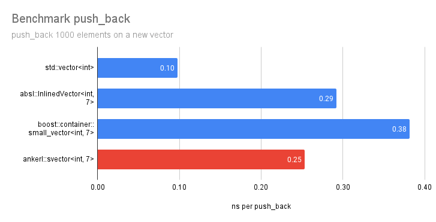
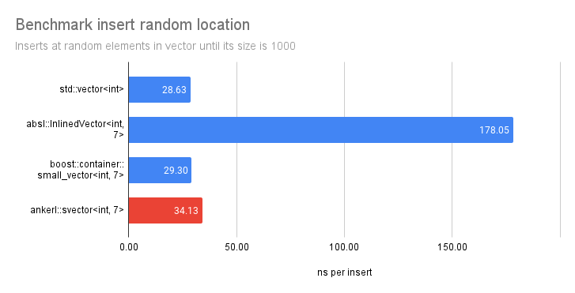

<a id="top"></a>

[](https://github.com/martinus/svector/actions)
[](https://raw.githubusercontent.com/martinus/svector/main/LICENSE)
[](https://bestpractices.coreinfrastructure.org/projects/6091)

# ankerl::svector 🚚 <!-- omit in toc -->

- [How compact can it get?](#how-compact-can-it-get)
- [Design](#design)
- [Benchmarks](#benchmarks)
  - [push\_back](#push_back)
  - [Random Access](#random-access)
  - [Random Insert](#random-insert)
- [Building \& Testing](#building--testing)
- [Disclaimer](#disclaimer)

`ankerl::svector` is an `std::vector`-like container that can hold some elements on the stack without the need for any allocation.
There are lots of small vector implementations ([absl](https://github.com/abseil/abseil-cpp/blob/master/absl/container/inlined_vector.h), [boost](https://www.boost.org/doc/libs/1_79_0/doc/html/boost/container/small_vector.html), [folly](https://github.com/facebook/folly/blob/main/folly/docs/small_vector.md), [llvm](https://llvm.org/doxygen/classllvm_1_1SmallVector.html), ...) but this here is special by how compact it is, while showing competitive benchmark results.

## How compact can it get?

What's the minimum `sizeof(..)` of the different implementations, how much storage does it have, and what's the overhead?

|                                  |  sizeof | storage | overhead |
|----------------------------------|--------:|--------:|---------:|
| `boost::container::small_vector` |    32   |     8   |     24   |
| `absl::InlinedVector`            |    24   |    16   |      8   |
| **`ankerl::svector`** 🚚         |  **8**  |   **7** |    **1** |

`ankerl::svector` can get as low as 8 bytes and still have space for 7 bytes on the stack. absl needs at least 24 bytes, and boost at least 32 bytes.

The storage overhead of `ankerl::svector` is just a single byte. Boost needs a whopping 24 bytes, absl is a bit better with 8 bytes overhead.

Note that boost's `small_vector` cheats a bit. E.g. `boost::container::small_vector<std::byte, 15>` won't give you 15 elements on the stack, but only 8 bytes. It seems to round down to the closest multiple of 8 bytes.

## Design

`ankerl::svector` uses a [tagged pointer](https://en.wikipedia.org/wiki/Tagged_pointer). It uses the lowest bit of a pointer to determine if the svector is in direct or indirect mode.

In **direct mode**, the lowest byte is the control structure. It's lowest *bit* is set to 1 to make it clear that it's direct mode, and the remaining 7 bit specify the current size. So we are limited to 127 elements of inline storage at most.

In **indirect mode**, the first 8 byte (4 byte for 32bit) hold a pointer to an allocated block which holds both a control structure and memory for the elements. The lowest bit of the pointer is always 0 (thanks to alignment) to mark that we are in indirect mode.

## Benchmarks

To my surprise, the performance of the `ankerl::svector` is actually quite good. I wrote benchmarks to compare it against 
`boost::container::small_vector`, `absl::InlinedVector` and of course `std::vector`. In all benchmarks I'm using [nanobench](https://github.com/martinus/nanobench). All compiled with clang++ 13.0.1 with `-std=c++17 -O3`, and run on an Intel i7-8700 that is frequency locked to 3.2GHz.

### push_back

This benchmark creates a new vector, and calls `push_back` to insert 1000 `int`. This is the benchmark loop:

```cpp
auto vec = Vec();
for (size_t i = 0; i < num_iters; ++i) {
    vec.push_back(i);
}
ankerl::nanobench::doNotOptimizeAway(vec.data());
```

To no surprise at all, `std::vector` is fastest here by a large margin. To much surprise though, `ankerl::svector` is actually quite fast compared to the other implementations.




### Random Access

Creates a vector with 1000 elements, then accesses it on random locations with `operator[]` and sums up the results. Benchmark loop is:

```cpp
sum += vec[rng.bounded(s)];
sum += vec[rng.bounded(s)];
sum += vec[rng.bounded(s)];
sum += vec[rng.bounded(s)];
```

To minimize loop overhead I'm doing the same operation 4 times. nanobench's Rng is used which has a highly optimized `bounded()` implementation (which is much faster than `%`).

![benchmark operator[]](doc/bench_randomaccess.png)

Another surprising result, `absl::InlinedVector` is much slower compared to all other alternatives, `ankerl::svector` is slower than `std::vector` or `boost` but not by a huge margin.

### Random Insert

Creates a new vector, and inserts a new element in a random location with `vec.emplace(it, i)`. This has to move lots of elements out of the way.

```cpp
auto rng = ankerl::nanobench::Rng(1234);
auto vec = Vec();
for (size_t i = 0; i < num_items; ++i) {
    auto it = vec.begin() + rng.bounded(vec.size());
    vec.emplace(it, i);
}
ankerl::nanobench::doNotOptimizeAway(vec.data());
```

Note that I always recreate a seeded random generator so the loop is 100% deterministic. Again, overhead from `rng` is negligible. 



For some reason `absl::InlinedVector` is almost 5 times slower than `std::vector`. I double checked that I'm actually compiling absl with `-O3`, and that is the case. While `ankerl::svector` is slower than `std::vector` or `boost::container::small_vector`, it is still by only about 20%.

## Building & Testing

This project uses the [Meson](https://mesonbuild.com/) build system for building. the CMakeLists.txt file is added as a convenience and does not build or run the tests.

How to configure & run the tests:

Clone  `svector`, move to the root directory, and run

```sh
meson setup builddir
cd builddir
meson test
```

## Disclaimer

`ankerl::svector` is new and relatively untested! I have implemented and tested all of std::vector's API though, and have 100% test coverage. Still, using it might set your computer on fire.
