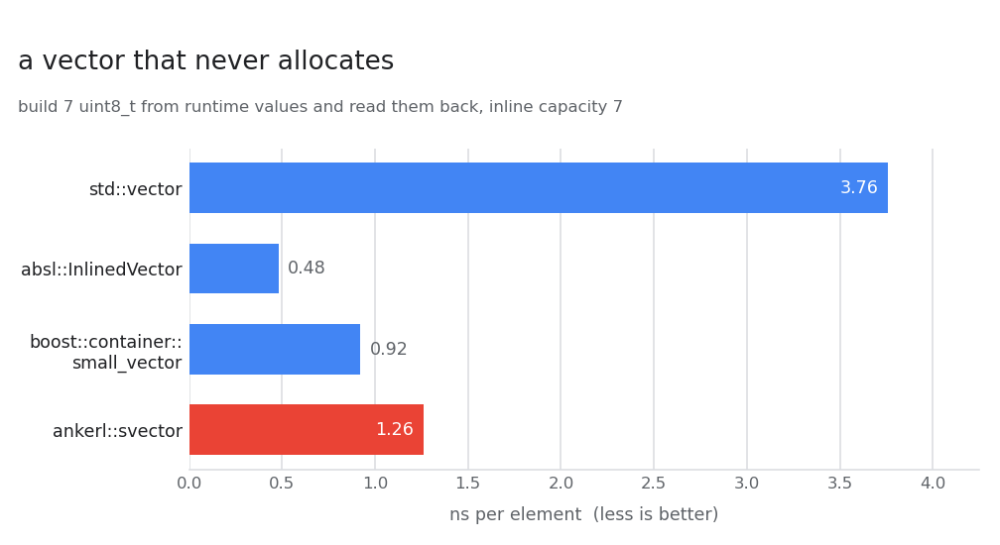
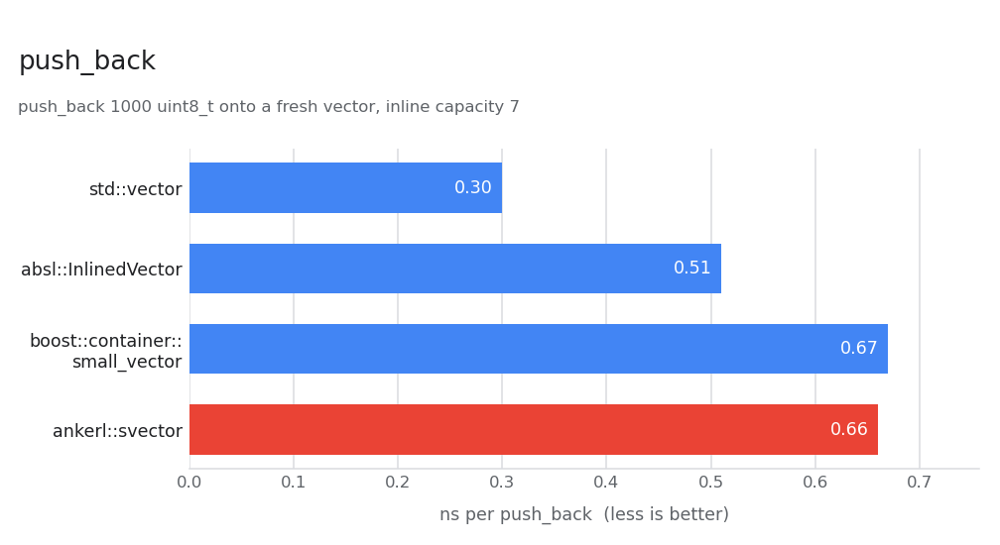
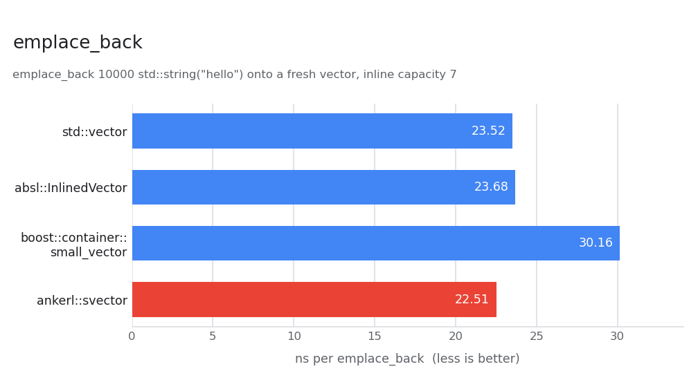
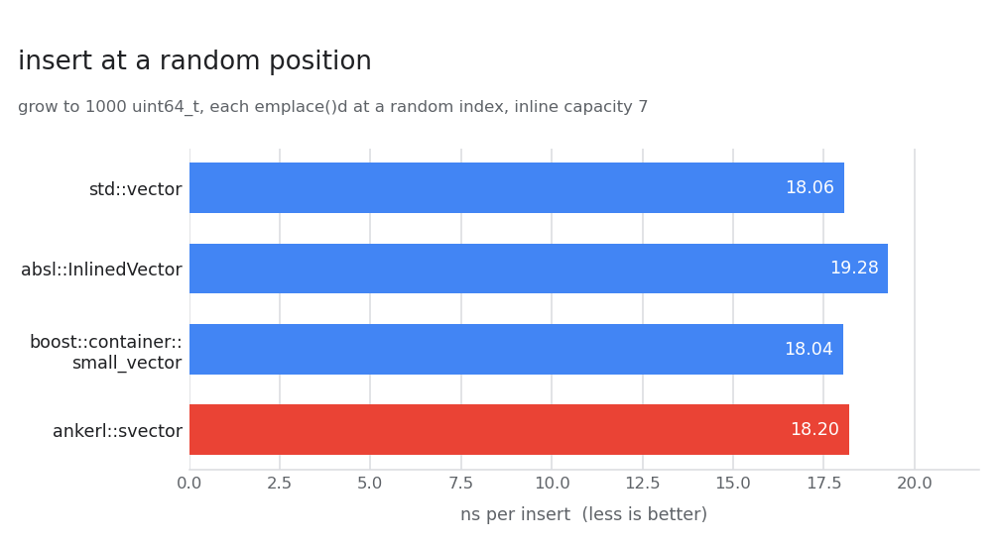
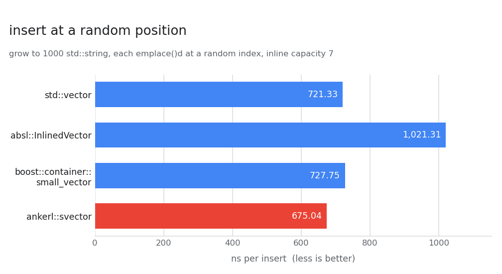
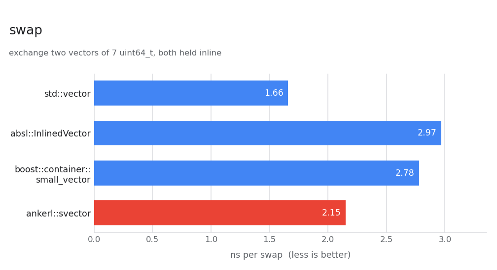
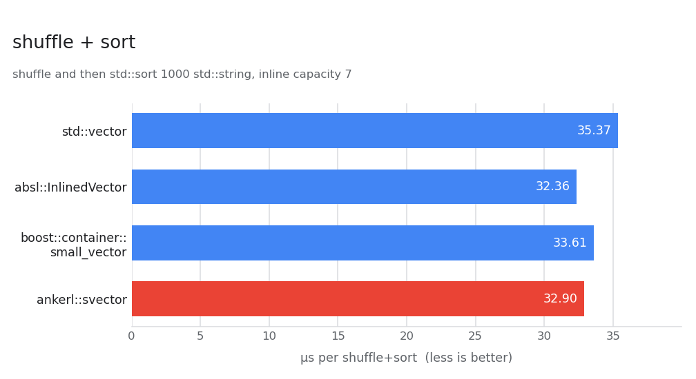

<a id="top"></a>

[](https://github.com/martinus/svector/actions)
[](https://raw.githubusercontent.com/martinus/svector/main/LICENSE)
[](https://bestpractices.coreinfrastructure.org/projects/6091)

# ankerl::svector 🚚 <!-- omit in toc -->

- [How compact can it get?](#how-compact-can-it-get)
- [Design](#design)
- [Benchmarks](#benchmarks)
  - [How they were run](#how-they-were-run)
  - [A vector that never allocates](#a-vector-that-never-allocates)
  - [Appending](#appending)
  - [Random access](#random-access)
  - [Inserting in the middle](#inserting-in-the-middle)
  - [Swapping](#swapping)
  - [Iterating and sorting](#iterating-and-sorting)
  - [All of it in one table](#all-of-it-in-one-table)
- [Differences from std::vector](#differences-from-stdvector)
- [Building \& Testing](#building--testing)
- [Status](#status)

`ankerl::svector` is an `std::vector`-like container that keeps a few elements inline, without allocating.
There are lots of small vector implementations ([absl](https://github.com/abseil/abseil-cpp/blob/master/absl/container/inlined_vector.h),
[boost](https://www.boost.org/doc/libs/release/doc/html/boost/container/small_vector.html),
[folly](https://github.com/facebook/folly/blob/main/folly/docs/small_vector.md),
[llvm](https://llvm.org/doxygen/classllvm_1_1SmallVector.html), ...); this one is unusual in how little space it
spends on bookkeeping, and it stays competitive on the benchmarks anyway.

It is a single header, C++17, MIT licensed:

```cpp
#include <ankerl/svector.h>

auto v = ankerl::svector<int, 7>(); // 7 int inline, heap only if it outgrows them
v.push_back(42);
```

## How compact can it get?

What is the smallest each implementation can be made, how many `uint8_t` fit inline at that size, and what does
the rest of the object cost?

|                                       | sizeof  | inline capacity | overhead |
| ------------------------------------- | ------: | --------------: | -------: |
| `std::vector<uint8_t>`                |   24    |           0     |    24    |
| `boost::container::small_vector`      |   32    |           8     |    24    |
| `absl::InlinedVector`                 |   24    |          16     |     8    |
| **`ankerl::svector`** 🚚              | **8**   |       **7**     |  **1**   |

`ankerl::svector` fits in a single 8 byte word and still keeps 7 bytes of payload in it. absl needs at least 24
bytes, boost at least 32. The overhead — everything that is not element storage — is one byte here, 8 for absl,
24 for boost.

Asking for more `uint8_t`, as sizeof / inline capacity:

| asked for | `boost` | `absl`  | `ankerl::svector` |
| --------: | ------: | ------: | ----------------: |
|         1 |  32 / 1 | 24 / 16 |         **8 / 7** |
|         8 |  32 / 8 | 24 / 16 |       **16 / 15** |
|        16 | 40 / 16 | 24 / 16 |       **24 / 23** |
|        32 | 56 / 32 | 40 / 32 |       **40 / 39** |
|        64 | 88 / 64 | 72 / 64 |       **72 / 71** |

None of the three ever hands back less than was asked for. Below 16 elements `svector` is in a different size
class entirely — a quarter of boost's object for one element. From 16 up it ties absl on size but keeps more in
it, because the overhead stays at one byte while absl's stays at eight. Boost is 16 bytes larger than `svector`
throughout.

Measured against boost 1.90.0 and abseil 20260107.1 on x86-64. `test/unit/show_comparison.cpp` prints this table
for whichever versions you have installed:

```sh
builddir/test/test-svector -ns -tc=show_comparison
```

## Design

`ankerl::svector` is a [tagged pointer](https://en.wikipedia.org/wiki/Tagged_pointer). The lowest bit of the first
byte says which of two modes the container is in.

In **direct mode** that first byte is the whole control structure: bit 0 is 1, and the remaining 7 bits are the
size. Everything after it, starting at the first correctly aligned offset, is element storage. Seven bits of size
is where the 127 element limit on inline capacity comes from.

In **indirect mode** the first `sizeof(void*)` bytes are a pointer to a heap block holding size, capacity and the
elements. Alignment guarantees bit 0 of that pointer is 0, which is what distinguishes the two modes.

Because the size lives in a byte that would otherwise be padding, the inline capacity is rounded up to whatever
fits in `sizeof(svector)` for free — `svector<uint8_t, 1>` really holds 7, and asking for 1 or for 7 gives you the
same type size.

The price is that every operation has to ask which mode it is in before it can find the data or the size. That is
a predictable branch, but it is not free, and the benchmarks below show where it lands.

## Benchmarks

Compared against `std::vector`, `absl::InlinedVector` and `boost::container::small_vector`, using
[nanobench](https://github.com/martinus/nanobench).

### How they were run

- gcc 16.1.1, `-std=c++17 -O3 -DNDEBUG`, boost 1.90.0, abseil 20260107.1
- AMD Ryzen 9 7950X, pinned to one core with `taskset`
- **one container per process**, 9 processes each, and every number below is the median of those
- run-to-run spread is under 3% except the `std::string` workloads, which allocate on every iteration and land
  around 7%. Differences smaller than that are not differences, and the tables below only mark a winner where
  the gap is larger than the spread

That one-container-per-process bit is not fussiness. Benchmarking four containers one after the other inside a
single process measures the wrong thing as soon as the workload allocates: glibc adapts its mmap threshold the
first time a large block is freed, so whoever runs first pays for `mmap`/`munmap` on every iteration and trains
the allocator for everyone behind them. On `emplace_back` of 10000 `std::string` that is worth a **factor of
three**, and it follows the position in the list rather than the container — put `svector` first and `svector` is
the slow one. Two of the results below reverse completely when measured that way. `test/bench/solo.cpp` runs one
workload against one container and exits, which is also what a program that uses one of them looks like.

The instruction counts quoted below come from perf and are deterministic, so they are the numbers to compare if
your machine is busier than a benchmark machine should be.

Reproduce with:

```sh
meson setup builddir --buildtype=release -Dcpp_args="-isystem /path/to/abseil-cpp"
meson compile -C builddir
./scripts/bench/render_charts.py builddir/test/bench-solo doc --runs 9
```

absl and boost join in only if their headers are visible at compile time, see `test/app/boost_absl.h`.

### A vector that never allocates

The case a small vector exists for: it stays inside its inline storage, so it never reaches the allocator.



Everything with inline storage beats `std::vector` by a wide margin here, because `std::vector` has to
allocate for the first element and free at the end. Among the three, `svector` is the slowest — it packs its
size into a byte it shares with the mode flag, so every append unpacks it and packs it back, where absl keeps a
plain `size_t` next to a plain pointer and pays 8 bytes for the privilege.

### Appending

Growing past the inline storage, one `uint8_t` at a time.



This is where the tagged pointer costs the most. `std::vector` bumps a pointer and compares it against another
pointer; `svector` works out which mode it is in, then reads the size from either a byte or a heap header. 15.3
instructions per `push_back` against 8.5, and it ends up 2.2x behind — level with boost, a shade behind absl.

Give the element some weight and that overhead stops being visible:



`svector` is fastest of the four here, and the smallest object of the four while doing it.

### Random access

1000 `int`, summed through `operator[]` at random indices.

![benchmark operator\[\]](doc/bench_randomaccess.png)

`std::vector` and boost compile the subscript to a load from a stored pointer, 10.0 instructions per read. absl
and `svector` have to pick the pointer first: 15.8 and 16.8. `svector` lands about 18% behind. absl gets closer
than its instruction count suggests, because its extra work does not depend on the load and overlaps with it.

### Inserting in the middle

Growing to 1000 elements, each `emplace`d at a random index, so most of the cost is moving the tail out of the way.



For a trivially copyable element the shift is a `memmove`, and `std::vector`, boost and `svector` are within
0.5% of each other. absl is 8% back.



For `std::string`, boost, `svector` and `std::vector` are within 13% of each other with a run-to-run spread of
6%, so read those three as a group; absl is the outlier, 38% to 56% behind them. Always inserting at the *front* instead —
the worst case for the shift — `svector` is the fastest of the four at 1320 ns against 1415 and 1417, with absl
again last at 2074.

### Swapping



`std::vector` wins this one by construction and always will: its whole state is three pointers, so a swap is
three exchanges no matter how many elements it holds. Anything with inline storage has to deal with the
elements themselves. Among the three that do, `svector` is the fastest.

Element type decides how much that costs. Two vectors of seven `std::string` that each own a heap buffer swap
in 15.7 ns; seven short strings that live inside themselves take 35.6 ns, because `std::swap` finds
`std::string::swap`, and for a short string that is three copies of the internal buffer where a longer string
would have exchanged one pointer. On the short strings absl and boost are within 1% of `svector`; on the heap
ones absl is 2% behind and boost 9%.

### Iterating and sorting

Once you are past the container and into the elements, the differences disappear. `std::accumulate` over 100
`uint64_t` is 0.10 ns per element and under 3 instructions for all four — the compiler vectorizes it and the
container is not in the way.

Shuffling and sorting 1000 `std::string`:



`svector` comes out ahead — 12% on `std::vector`, 5% on absl, 7% on boost — but the run-to-run spread here is
7%, so only the gap to `std::vector` is bigger than the noise.

### All of it in one table

ns per operation, median of 9 processes, less is better. **Bold** is the best of the four, marked only where the
gap is bigger than the run-to-run spread.

| benchmark                                  | `std::vector` |   `absl` |  `boost` | `ankerl::svector` |
| ------------------------------------------ | ------------: | -------: | -------: | ----------------: |
| build 7 inline, per element                 |          3.85 | **0.48** |     0.92 |              1.26 |
| `push_back` `uint8_t`                       |      **0.30** |     0.51 |     0.67 |              0.66 |
| `emplace_back` `std::string`                |         23.52 |    26.13 |    30.54 |         **22.64** |
| `accumulate` `uint64_t`, per element        |          0.10 |     0.10 |     0.10 |              0.11 |
| `operator[]` random, per read               |          0.57 |     0.58 | **0.56** |              0.67 |
| insert at random index, `uint64_t`          |         18.01 |    19.43 |    18.06 |             18.06 |
| insert at random index, `std::string`       |         768.6 |   1061.0 |    681.5 |             721.4 |
| insert at front, `uint64_t`                 |         30.39 |    30.73 |    30.46 |             30.74 |
| insert at front, `std::string`              |        1415.2 |   2073.9 |   1416.7 |        **1320.2** |
| shuffle + sort, 1000 `std::string`          |         35435 |    32905 |    33503 |             31305 |
| swap, 7 `uint64_t` inline                   |      **1.66** |     3.02 |     2.79 |              2.15 |
| swap, 7 heap `std::string`                  |      **1.66** |    16.03 |    17.02 |             15.66 |
| swap, 7 short `std::string`                 |      **1.66** |    35.78 |    35.93 |             35.61 |

Instructions per operation, which have no noise at all:

| benchmark                             | `std::vector` | `absl` | `boost` | `ankerl::svector` |
| ------------------------------------- | ------------: | -----: | ------: | ----------------: |
| build 7 inline, per element            |          61.6 |    8.4 |    23.1 |              30.0 |
| `push_back` `uint8_t`                  |           8.5 |   17.2 |    14.3 |              15.3 |
| `emplace_back` `std::string`           |          67.7 |  103.1 |   124.2 |              82.8 |
| `operator[]` random, per read          |          10.0 |   15.8 |    10.0 |              16.8 |
| insert at random index, `uint64_t`     |         157.2 |  222.8 |   161.8 |             179.4 |
| swap, 7 `uint64_t` inline              |          10.0 |   41.0 |    89.0 |              33.0 |

The shape of it: `svector` pays for its one byte of overhead on the operations that are *only* container
bookkeeping with a trivially copyable element — 18% behind `std::vector` on a subscript, 2.2x on a `push_back`,
and 2.6x behind absl at filling inline storage. As soon as an operation does real work with the elements it is
level with the alternatives or ahead: fastest of the four at `emplace_back`ing strings and at inserting them at
the front, fastest of the three inline containers at swapping, and no worse than any of them at sorting — while
being a third the size of the next smallest object.

## Differences from std::vector

`ankerl::svector` implements all of `std::vector`'s API, plus `std::erase`/`std::erase_if`, and comparison
operators that work between svectors of different inline capacities.

The third template parameter is the allocator, and it defaults to `std::allocator<T>`, so `svector<T, N>` means
what it always did:

```cpp
auto v = ankerl::svector<int, 7, MyAllocator<int>>(MyAllocator<int>(arena));
```

Only the heap allocation goes through it — nothing is asked of it while the elements are still inline. A
stateless allocator is an empty base, so it costs the object nothing and `sizeof` stays exactly what the table
above says. Elements are built and destroyed through `std::allocator_traits`, so an allocator that constructs
its own way is honoured: `std::pmr::polymorphic_allocator` passes its resource on to the elements, the same as
in `std::vector`. When an allocator does not do that, the `<memory>` range algorithms are used instead, which is
what keeps a relocation of a trivially copyable `T` a `memcpy`. `propagate_on_container_copy_assignment`,
`..._move_assignment` and `..._swap` all mean what the standard says they mean, and a move assignment between
two unequal allocators that do not propagate moves the elements one at a time rather than stealing memory it
could not give back.

A few things are deliberately not the same as `std::vector`:

- **Move is only `noexcept` when the element's move is.** `std::vector` can promise an unconditional `noexcept`
  because moving it is just stealing a pointer. In direct mode the inline elements have to be relocated, which
  calls `T`'s move constructor, so the promise is only ours to make when that one is `noexcept`. Claiming it
  anyway would turn a throwing move into `std::terminate`.
- **At most 127 inline elements**, because the direct-mode size has to fit in 7 bits.
- **No allocator with a fancy pointer.** `svector`'s `iterator` is a `T*`, so an allocator whose `pointer` is
  anything else is rejected with a `static_assert` rather than quietly misused. Everything else about an
  allocator works as `std::vector` promises — see below.
- **`resize_and_overwrite(count, op)`**, an extension with the same contract as
  [`std::string::resize_and_overwrite`](https://en.cppreference.com/w/cpp/string/basic_string/resize_and_overwrite):
  it hands you the raw storage and lets you fill it, skipping the value initialization `resize(count)` owes you.
- **`insert` of several elements gives the basic guarantee**, not the strong one, when it has to shift elements
  that are already there — the same thing `std::vector` does, and what the standard asks for. Inserting a single
  element either happens completely or not at all, and so does an insert that reallocates, unless relocating a
  `T` is what throws.

## Building & Testing

This project uses the [Meson](https://mesonbuild.com/) build system. The `CMakeLists.txt` is a convenience for
consumers and does not build or run the tests.

```sh
meson setup builddir
cd builddir
meson test
```

`meson test` runs the unit tests — 108 cases and ~630k assertions, much of it comparing against `std::vector`
operation by operation — and replays a 1651 entry fuzzing corpus. CI additionally builds on Linux, macOS and
Windows, at C++20 as well as the default C++17 and at C++23 on Linux, under address+undefined sanitizers, and
with a distribution's hardening flags including `_GLIBCXX_ASSERTIONS`. It also compiles a small consumer
project against `CMakeLists.txt`, which is the only thing that exercises the CMake path.

Benchmarks are separate and want a release build. There are two of them:

```sh
meson setup builddir --buildtype=release
meson compile -C builddir

# all four containers in one process, quick, good for A/B testing a change to svector against itself
meson test -C builddir --benchmark

# one container per process, slower, and the only one to compare different containers with.
# See test/bench/solo.cpp for why.
./scripts/bench/render_charts.py builddir/test/bench-solo doc --runs 9
```

## Status

The API is complete and the test suite is thorough — differential tests against `std::vector`, a fuzzer with a
saved corpus, sanitizers and a hardened build in CI. It is still a young container maintained by one person, so
read the [open issues](https://github.com/martinus/svector/issues) before you put it somewhere it would hurt.
